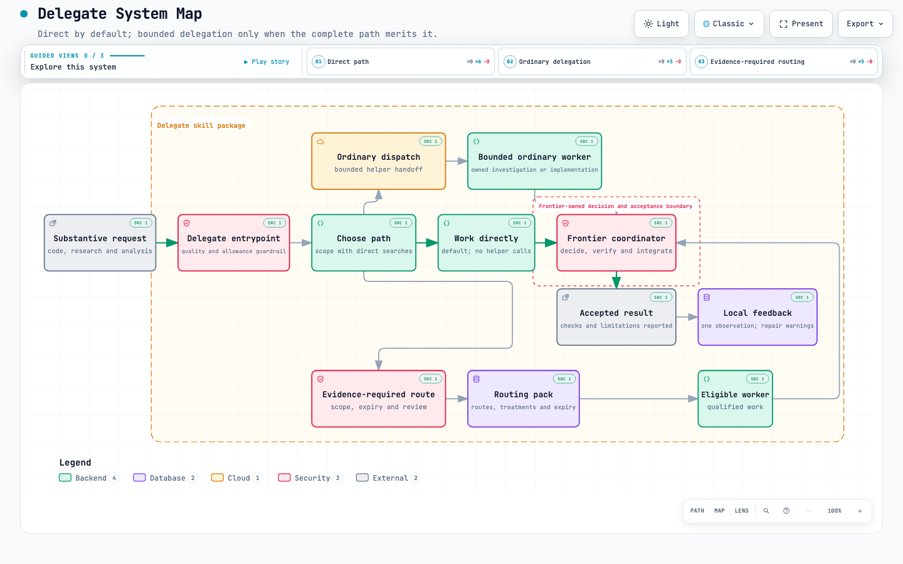

# Delegate

**Your strongest model, with cheaper help only where it pays.**

Delegate is a portable skill for Claude Code and Codex that decides whether to do a task directly or hand bounded parts to cheaper models, while your strongest model keeps the decisions, verification and final result. **Direct execution is the default.**

It automatically considers delegation for substantive implementation, investigation, research, analysis, planning and review—not just coding. Creative drafting and voice-sensitive editing stay with your primary model unless you explicitly request delegation; bounded research and factual or continuity checks can be considered separately. Casual conversation, simple factual answers and worker packets do not trigger it.

## What the evidence says so far

The two ordinary-workflow comparisons on bounded TypeScript tasks favored direct execution on whole-arm API-equivalent estimates. Delegating cost about twice and over three times the estimated direct cost; the coordinator alone cost more than the entire direct arm, and it corrected a worker's invalid proposal before implementation. These are price proxies, not measured subscription savings. See the [ordinary comparison](docs/delegate-ordinary-results-2026-09-11.md).

The [older Claude Code and Codex comparisons](docs/delegate-direct-vs-delegated-results.md) favored direct on elapsed time, not a comparable usage verdict. Codex's child-counter coverage was unknown. Those speed results are not additional economic wins.

So Delegate stays direct unless one of these holds:

- **A large investigation:** answering needs reading across several packages, source collections or a large unfamiliar subject area, far more than a brief plus checking the decisive sources.
- **Independent parallel work:** two or more workstreams with settled interfaces or clear deliverables and separate ownership can run at once.
- **You ask for it:** you request a worker or a specific model.

The first two are untested hypotheses, not proven savings.

## When it does delegate

```text
Direct search sizes the work
    ↓
Worker investigates → evidence + unresolved decision
    ↓
Frontier decides
    ↓
Worker continues → frontier verifies → done
```

A worker gets a bounded question or change: the scope, the permitted actions and where to stop. It returns source locations, checks and anything still unresolved. The frontier checks the decisive evidence, settles the decision and sends a bounded follow-up, reusing the worker's context when useful.

Every delegated result gets frontier verification: the sources, changed artifact, relevant tests or rendered interface that support acceptance. Concrete defects go back for targeted repair. A worker that needs repeated repairs isn't cheap, so repeated failure falls back to a stronger worker or direct execution. Work stops when the requested result is complete.

An MVP and a large TypeScript monorepo use the same principle: bound the assignment, not the repository. Start with a symbol, symptom or feature. Find its owner, trace the relevant dependencies, then make or assign a coherent change. Reading can cross package boundaries while write ownership stays explicit. Integration checks follow affected consumers and contracts; a green test in one package isn't the whole result. Delegate searches directly first and never maps the whole codebase up front.

## See the system



The map shows the direct default, ordinary bounded delegation, evidence-required route, frontier acceptance boundary and local feedback loop.

## Keep the experience small

Delegate fits the coding environment you already use. Install one folder and invoke it with an ordinary task. Your existing authentication and available models supply the execution.

Delegated investigations use a short brief and one compact outcome record: result, checks and repairs. They still return evidence and receive verification, without a receipt-writing sequence. You can explicitly request a worker, a model or independent review when that matters to the job.

There is no service to host, daemon to supervise or extra API key to manage. The routing helper uses an existing Node runtime and built-in libraries. Model Governor, the tooling maintained in this repository, is not required to use the installed skill.

**No measured savings have been established for any delegation workflow here; its delegation conditions are hypotheses until matched evidence shows otherwise.**

## Install and use

Clone the source:

```sh
git clone https://github.com/GregStarling/ai-skills.git
```

Choose your environment. These commands install for your user and refuse to overwrite an existing folder or symlink.

**Codex**

```sh
mkdir -p ~/.agents/skills
test ! -e ~/.agents/skills/delegate && test ! -L ~/.agents/skills/delegate &&
  cp -R ai-skills/skills/delegate ~/.agents/skills/delegate
```

**Claude Code**

```sh
mkdir -p ~/.claude/skills
test ! -e ~/.claude/skills/delegate && test ! -L ~/.claude/skills/delegate &&
  cp -R ai-skills/skills/delegate ~/.claude/skills/delegate
```

For a project-only installation, use that project's `.agents/skills/` or `.claude/skills/` directory instead. Copy the **entire `delegate` folder**, including its helper and routing pack.

In Codex:

```text
$delegate trace where this setting is read and explain its default
$delegate summarize these local documents and flag contradictions
$delegate apply this API rename across the affected TypeScript packages
```

In Claude Code, use `/delegate` with the same requests. You describe the job; the coordinator bounds the assignments and checks available workers, permissions and verification needs. Your repository's language and size aren't dispatch gates. Stricter project routing policies still apply.

Claude Code's ordinary defaults are native Haiku for economy work and Sonnet for standard work, selected explicitly through Agent. Unsupported or unobserved effort stays unknown; ordinary delegation does not start a separate CLI just to tune it.

To update, pull the repository and replace the complete installed folder. Keep rollback copies **outside skill-discovery directories** to avoid duplicate skills. Personal learning state survives replacement.

## What makes the routing predictable

Ordinary dispatch maps concrete assignments to two host-supplied slots: economy for search, source analysis and low-risk precise edits; standard for reproduction, features, fixes, UI and settled plans. The helper returns one worker and a verification choice. No additional model call ranks the roster. These are declared starting heuristics, not measured savings or universal model-capability claims.

The coordinator confirms actual model/effort controls, task boundaries and tools. Unsettled fix diagnoses or interfaces, missing workers and high-risk actions return for frontier attention. Required independent review stays independent. Recent same-project/assignment/model failures and repairs inform reconsideration; direct execution remains an option.

For projects requiring evidence-qualified routing, the separate pack contains **15 provisional routes and zero fully qualified entries**. Its narrow JavaScript/HTML fixture scopes remain unchanged; they do not qualify TypeScript or large-repository work. A qualification requirement cannot be bypassed by switching to ordinary dispatch. See the [coverage audit](docs/delegate-routing-coverage.md) for both paths.

## Learning that follows the usage goal

Ordinary delegated work records a small local outcome, including investigations. Missing usage doesn't prevent failure/repair feedback. Evidence-routed, fully tracked preferences require at least five supported comparable tasks per option. Quality and repair burden come first; complete comparable allowance or attributable-cost observations can then break ties. **Neither elapsed time nor raw token totals select learned winners.**

Missing or partial usage remains unknown. A cheap-model token and a frontier token aren't interchangeable subscription units. Model-specific, cache-aware price estimates are labeled separately from observed spending. Personal history stays on your machine and cannot broaden evidence authority or weaken verification. In the [two new TypeScript comparisons](docs/delegate-ordinary-results-2026-09-11.md), all arms passed, but Haiku investigation → Opus decisions → Sonnet implementation cost more by the API-equivalent proxy than direct Opus. These small samples do not establish subscription savings or general large-repository performance.

Evidence packs carry refresh and expiry dates; this pack calls for refresh after seven days and expires after thirty. Updating a pack doesn't renew its evidence. Ordinary host dispatch doesn't depend on that pack. Details: [local learning](skills/delegate/local-learning.md), [routing maintenance](docs/routing-pack-maintenance.md), and [validation status](docs/validation-status.md).

## For maintainers

The rest of the repository compiles and validates the portable routing pack. To run the release checks:

```sh
npm ci
npm test
npm run typecheck
npm run build
node scripts/verify/skills.mjs
node dist/cli/index.js validate-routing-pack --input skills/delegate/routing-pack.json
```

GitHub Actions runs these checks on pull requests and pushes to `main`. Passing software checks does not establish model qualification or measured savings. The [validation index](docs/validation-status.md) separates current artifacts from historical model trials.

The [evidence-path assessment](docs/delegate-evidence-path-assessment.md) recommends later separation while preserving existing publishers and receipt consumers. Nothing has been removed.
